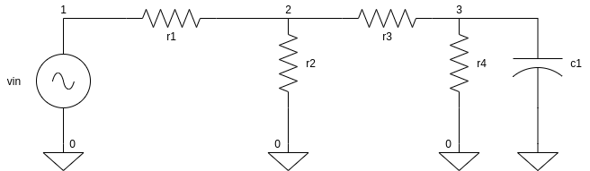

### AC ANALYSIS 



```
Name 19------/19d---- ,ac analysis 

**parameter 
.temp 27 

**input 
vin 1 0 dc 0v ac 1v


**circuit 
r1 1 2 1k
r2 2 0 1k 
r3 2 3 1k 
r4 3 0 1k
c1 3 0 1uF 

**command 
.ac dec 10 1 100k 

.end 
```
Do The following on ngspice prompt ,<br />
check what type of vector is v(3) 

```
ngspice 1 -> source ac.cir 
ngspice 1 -> run 
ngspice 1 -> plot vdb(v(3))
ngspice 1 -> plot vp(v(3))

```


