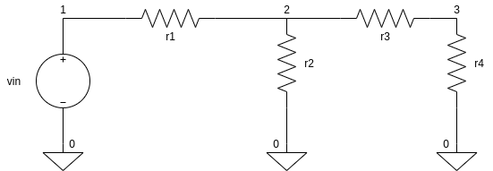

### OPERATING POINT ANALYSIS 



```
First line should be your name and roll_no what circuit is doing
**This is a comment in ngspice 
**Comments are used to make netlists more readable 

**parameter 
.temp 27

**input 
vin 1 0 dc 1v 

**circuit 
r1 1 2 1k
r2 2 0 1k 
r3 2 3 1k
r4 3 0 1k 

**command 
.op

.end
```
Do the following .<br />
The $ sign is the linux terminal 

```
$ ngspice 
******
** ngspice-27 : Circuit level simulation program
** The U. C. Berkeley CAD Group
** Copyright 1985-1994, Regents of the University of California.
** Please get your ngspice manual from http://ngspice.sourceforge.net/docs.html
** Please file your bug-reports at http://ngspice.sourceforge.net/bugrep.html
** Creation Date: Tue Dec 26 17:10:20 UTC 2017
******
ngspice 1 -> source op.cir  
ngspice 1 -> run
ngspice 1 -> display 
ngspice 1 -> print v(3)
```
