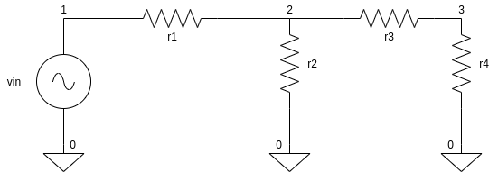

### TRANSIENT ANALYSIS 



```
Name 19----/19d----,resistive transient analysis

**parameter 
.temp 27 

**input 
vin 1 0 sin(0 1 1k)


**circuit 
r1 1 2 1k
r2 2 0 1k 
r3 2 3 1k 
r4 3 0 1k

**command 
.tran 0.1m 1m 

.end
```
On ngspice prompt enter the following 

```
ngspice 1 -> source transient.cir
ngspice 1 -> run
ngspice 1 -> display 
ngspice 1 -> plot v(3) v(3,2)
ngspice 1 -> hardcopy output_transient.ps v(3)

```
 
